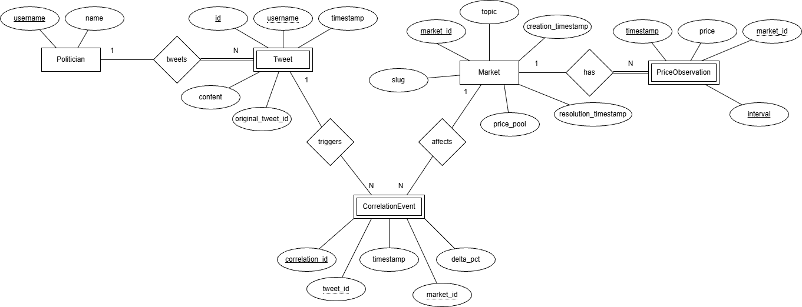

# Sibyl

Sibyl is a Flask and PostgreSQL app for comparing politician tweets with Polymarket price movements.

## Run

Build and run with:
```bash
docker compose up --build
```

Open:
```text
http://localhost:5000
```

Stop:

```bash
docker compose down
```

*NOTE* This might be a **SLOW** process, so be patient.
On startup, the app creates the database tables, loads JSON data from `data/`, and computes the correlation cache.


*If you want to go the nuclear option and nuke everything, then rebuild it, use this:*
```bash
docker compose down -v && docker compose build --no-cache web && docker compose up --force-recreate
```

## Pages

* `/` - redirects to `/correlations`
* `/tweets` - tweets, with filters for user, date range, and limit
* `/markets` - markets, with a row limit
* `/correlations` - tweet/market correlations, with filters and links
* `/settings` - correlation settings


## E/R model



## Database

Tables:

* `politician` - `username`, `name`
* `tweet` - `id`, `original_tweet_id`, `username`, `tweet_timestamp`, `content`
* `market` - `market_id`, `topic`, `slug`, `creation_timestamp`, `resolution_timestamp`, `price_pool`
* `price_observation` - `market_id`, `timestamp`, `interval`, `price`
* `correlation_event` - `correlation_id`, `tweet_id`, `market_id`, `timestamp`, `delta_pct`

`correlation_event` is a cache. It is deleted and recomputed when the correlation settings change.

## Correlations

For every tweet/market pair:

1. Find the latest non-zero market price at or before the tweet.
2. Find the strongest price move inside the selected window after the tweet.
3. Store the pair if the absolute percentage change is at least the threshold.

```text
delta_pct = (later_price - baseline_price) / baseline_price * 100
```

Defaults:

```text
window = 4 hours
threshold = 80%
```

The correlations page can filter already-computed rows by tweet text using the following **regex**:

* `hashtag` - `#\w+`
* `mention` - `@\w+`
* `cashtag` - `\$[A-Z]{1,6}`
